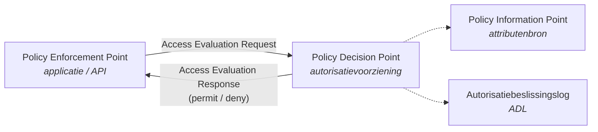
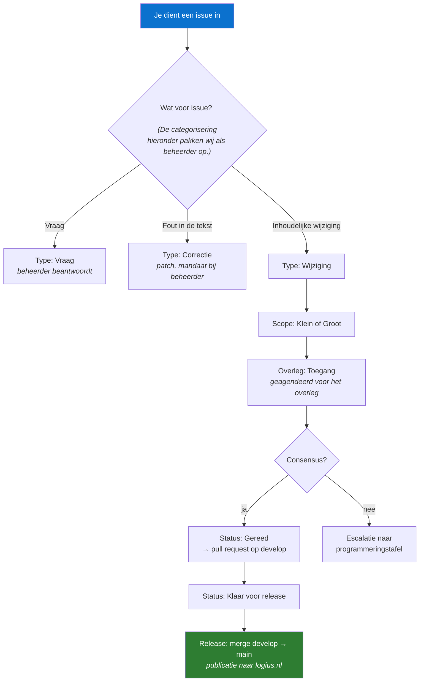

<h1 align="center">NLgov Profile for OpenID AuthZEN Authorization API</h1>

<p align="center">
  <em>Nederlands overheidsprofiel op de OpenID AuthZEN Authorization API.<br/>
  Toegangsvragen en -beslissingen uitwisselen tussen applicaties en autorisatievoorzieningen.</em>
</p>

<p align="center">
  <a href="https://gitdocumentatie.logius.nl/publicatie/ftv/authzen/"></a>
  <a href="https://logius-standaarden.github.io/authzen-nlgov/"></a>
  <a href="https://github.com/Logius-standaarden/authzen-nlgov/actions/workflows/build.yaml"></a>
  <a href="LICENSE"></a>
</p>

<p align="center">
  <a href="https://gitdocumentatie.logius.nl/publicatie/ftv/authzen/"><b>Vastgestelde versie</b></a> &nbsp;·&nbsp;
  <a href="https://logius-standaarden.github.io/authzen-nlgov/"><b>Werkversie</b></a> &nbsp;·&nbsp;
  <a href="https://github.com/Logius-standaarden/authzen-nlgov/issues/new/choose"><b>Issue indienen</b></a> &nbsp;·&nbsp;
  <a href="https://vng-realisatie.github.io/ftv/methodiek/authzen-nlgov/"><b>Project FTV</b></a> &nbsp;·&nbsp;
  <a href="https://gitdocumentatie.logius.nl/publicatie/api/beheermodel/"><b>Beheermodel</b></a>
</p>

---

## Beheerstatus

<!-- BEHEER:START -->
<!-- Dit blok kan waarschijnlijk automatisch gegenereerd worden via .github/workflows/readme.yml.
     Handmatige wijzigingen tussen BEHEER:START en BEHEER:END worden dan overschreven. -->

| | Branch | Status | Versie | Publicatiedatum |
|---|---|---|---|---|
| **Vastgesteld** | `main` | Definitief (DEF) | 1.0.0 | 25 juni 2026 |
| **Werkversie** | `develop` | Werkversie (WV) | 1.0.0 | 25 juni 2026 |

> `develop` loopt **0 commits** voor op `main` - geen onverwerkte wijzigingen richting release.

### Openstaande issues - 1 open, 0 gesloten

| Status | Aantal | Issues |
|---|---|---|
| `Status: In onderzoek` | 1 | [#7](https://github.com/Logius-standaarden/authzen-nlgov/issues/7) |
| `Status: In bewerking` | 0 | - |
| `Status: Uitwerking door derden` | 0 | - |
| `Status: Ter goedkeuring` | 0 | - |
| `Status: Gereed` | 0 | - |
| `Status: Klaar voor release` | 0 | - |
| _zonder Status-label_ | 0 | - |

- **Op de agenda van een overleg:** geen issues met een `Overleg:`-label.
- **Niet behandeld** (geen `Type:`-label): geen.

### Openstaande pull requests - 0 open

_Geen openstaande pull requests._

### Laatste geslaagde publicatie

`Build and Check` #53 op `main` - publicatie naar `gitdocumentatie.logius.nl` geslaagd.

<sub>Laatst bijgewerkt: 14 augustus 2026, 09:00 CEST · <a href="https://github.com/Logius-standaarden/authzen-nlgov/actions/workflows/readme.yml">workflow</a></sub> <!-- Hier moet een echte link komen naar een workflow, als we dit willen automatiseren -->
<!-- BEHEER:END -->

---

## Over deze standaard

AuthZEN is een standaard van de OpenID Foundation voor het uitwisselen van toegangsvragen en -beslissingen tussen een **Policy Enforcement Point (PEP)** en een **Policy Decision Point (PDP)**. Dit profiel legt vast hoe die uitwisseling er binnen de Nederlandse overheid uitziet: welke velden verplicht zijn, welk informatiemodel geldt, en welke eisen aan transport en beveiliging worden gesteld.

Het profiel is ontwikkeld door VNG Realisatie vanuit een vernieuwingsvoorstel van de GDI, in het kader van het **Federatief Datastelsel (FDS)**. Beheer ligt bij Logius.



<details> <!-- geen idee of we dit willen bijhouden maar ziet er wel nice uit -->
<summary><b>Verwante standaarden en profielen</b></summary>

<br/>

| Standaard | Rol ten opzichte van dit profiel | Repository |
|---|---|---|
| Autorisatiebeslissingslog (ADL) | Vastleggen van genomen toegangsbeslissingen | [`authorization-decision-log`](https://github.com/Logius-standaarden/authorization-decision-log) |
| NLgov Assurance profile for OAuth 2.0 | Levert het access token waarmee de PEP zich identificeert | [`OAuth-NL-profiel`](https://github.com/Logius-standaarden/OAuth-NL-profiel) |
| NLgov Assurance profile for OpenID Connect | Levert de authenticatie van de eindgebruiker | [`OIDC-NLGOV`](https://github.com/Logius-standaarden/OIDC-NLGOV) |
| NLgov Profile for CloudEvents | Notificatiepatroon bij wijzigende autorisaties | [`NL-GOV-profile-for-CloudEvents`](https://github.com/Logius-standaarden/NL-GOV-profile-for-CloudEvents) |

</details>

---

## Meedoen

Iedereen mag meedoen. Er is geen lidmaatschap en als contributor mag je altijd deelnemen aan de TO's (via github of email). Het beheermodel is expliciet open voor de hele community.



**Wat kun je doen:**

- **Een vraag stellen** over de interpretatie van het profiel → [open een issue](https://github.com/Logius-standaarden/authzen-nlgov/issues/new/choose) met `Type: Vraag`. Vragen worden beantwoord door de beheerder en, als het antwoord tot verduidelijking in de tekst leidt, omgezet naar een `Type: Correctie`.
- **Een fout melden** in spelling, verwijzingen of voorbeelden → `Type: Correctie`. Dit gaat als patch mee in de eerstvolgende release; hiervoor is geen besluit van het overleg nodig.
- **Een wijziging voorstellen** → `Type: Wijziging`. Dit wordt geagendeerd voor het overleg. Beschrijf het probleem, niet alleen de oplossing.
- **Meelezen op een consultatie** → consultatieversies staan in branches met het voorvoegsel `consultatie/` en worden aangekondigd via [Openbare-Consultaties](https://github.com/Logius-standaarden/Openbare-Consultaties).

<details>
<summary><b>Labels en wat ze betekenen</b></summary> <!-- dit moet ook ergens automatisch worden opgehaald lijkt mij. -->

<br/>

De labels volgen het beheermodel. Ze worden centraal beheerd vanuit [`Automatisering`](https://github.com/Logius-standaarden/Automatisering) en zijn identiek in alle standaardrepositories.

**`Type:`** - wat voor soort issue het is

| Label | Betekenis |
|---|---|
| `Type: Vraag` | Vraag over de standaard, geen voorgestelde wijziging |
| `Type: Correctie` | Tekstuele correctie zonder gevolgen voor implementaties (patch) |
| `Type: Wijziging` | Inhoudelijk voorstel dat het overleg langs moet |

**`Scope:`** - hoe groot de impact is

| Label | Betekenis |
|---|---|
| `Scope: Klein` | Beperkte impact, achterwaarts compatibel (minor) |
| `Scope: Groot` | Grote impact, implementaties moeten mee (major) |

**`Status:`** - waar het issue in het proces staat

| Label | Betekenis |
|---|---|
| `Status: In onderzoek` | Onderzoek nodig vóór uitwerking |
| `Status: In bewerking` | In behandeling bij de beheerorganisatie |
| `Status: Uitwerking door derden` | Wacht op een externe partij |
| `Status: Ter goedkeuring` | Uitgewerkt, ligt ter besluitvorming voor |
| `Status: Gereed` | Aangenomen, kan worden doorgevoerd |
| `Status: Klaar voor release` | Verwerkt, gaat mee in de volgende release |
| `Status: Afgewezen` | Afgewezen; kan na aanpassing opnieuw worden ingediend |

Op pull requests wordt het `Status:`-label automatisch gezet door de workflow `Update labels`.

**`Overleg:`** - voor welk overleg het issue geagendeerd staat. Issues met een `Overleg:`-label worden automatisch opgenomen in de agenda in [`Overleg`](https://github.com/Logius-standaarden/Overleg).

</details>

<details>
<summary><b>Versiebeheer en releases</b></summary>

<br/>

Dit profiel volgt [Semantic Versioning 2.0.0](https://semver.org/lang/nl/), zoals vastgelegd in het beheermodel:

| Component | Wanneer | Besluit door |
|---|---|---|
| **PATCH** (1.0.**x**) | Tekstuele correcties zonder gevolgen voor implementaties | Beheerder |
| **MINOR** (1.**x**.0) | Nieuwe functionaliteit, bestaande implementaties blijven voldoen | Programmeringstafel |
| **MAJOR** (**x**.0.0) | Wijzigingen waarvoor implementaties moeten worden aangepast | Programmeringsraad GDI |

Er worden maximaal twee opeenvolgende versies tegelijk ondersteund.

**Branchmodel:**

| Branch | Betekenis | Publiceert naar |
|---|---|---|
| `develop` | Werkversie - hier komen alle wijzigingen samen | [logius-standaarden.github.io](https://logius-standaarden.github.io/authzen-nlgov/) |
| `main` | Vastgestelde versie | [gitdocumentatie.logius.nl](https://gitdocumentatie.logius.nl/publicatie/ftv/authzen/) |
| `consultatie/*` | Consultatieversie - `specStatus` wordt automatisch op `cv` gezet | preview |
| overig | Voorstel in bewerking | [Publicatie-Preview](https://logius-standaarden.github.io/Publicatie-Preview/) |

> Maak geen directe pull request van `develop` naar `main`. Vertak vanaf `develop` en dien die branch in - de build blokkeert de directe route om te voorkomen dat een werkversie per ongeluk als vastgestelde versie wordt gepubliceerd.

</details>

<details>
<summary><b>Lokaal bouwen</b></summary>

<br/>

De specificatie is een [ReSpec](https://respec.org/docs/)-document. `index.html` bevat alleen de structuur; de inhoud staat als markdown in `sections/`.

```bash
git clone https://github.com/Logius-standaarden/authzen-nlgov.git
cd authzen-nlgov
python3 -m http.server 8000
# open via browser http://localhost:8000
```

ReSpec en de Logius-huisstijl worden op geladen vanaf `logius-standaarden.github.io/publicatie` - geen buildstap en geen `node_modules` nodig.

| Pad | Inhoud |
|---|---|
| `index.html` | Documentstructuur: welke secties in welke volgorde |
| `js/config.mjs` | ReSpec-configuratie: status, versie, datum, redacteuren, bibliografie |
| `sections/*.md` | De normatieve en informatieve tekst |
| `.github/workflows/build.yaml` | Roept de gedeelde build-, check- en publiceer-workflows aan |

Elke pull request bouwt automatisch een preview, controleert WCAG-toegankelijkheid met axe, en genereert een PDF.

</details>

<details>
<summary><b>Governance</b></summary>

<br/>

Het beheer volgt [BOMOS](https://www.forumstandaardisatie.nl/thema/bomos) en is vastgelegd in het [beheermodel](https://gitdocumentatie.logius.nl/publicatie/api/beheermodel/).

| Niveau | Gremium | Besluit over |
|---|---|---|
| Community | iedereen | issues, RFC's, consultatiereacties |
| Operationeel | Technisch Overleg | prioritering, inhoudelijke uitwerking, releaseplanning |
| Tactisch | Programmeringstafel | roadmap, minor en major releases |
| Strategisch | Programmeringsraad GDI | majeure wijzigingen en nieuwe standaarden |
| Beleid | OBDO | mandaat en kaders |

**Beheerder:** Logius · **Contact:** [servicecentrum@logius.nl](mailto:servicecentrum@logius.nl)

</details>

---


## Licentie

De specificatie staat onder [Creative Commons Naamsvermelding 4.0 Internationaal](LICENSE) (CC-BY-4.0). Dit document is een bewerking van de [OpenID AuthZEN Authorization API 1.0 draft 04](https://openid.net/specs/authorization-api-1_0-04.html) van de OpenID Foundation; voor zover die specificatie hierin is opgenomen geldt de [OpenID Copyright License](https://openid.net/intellectual-property/contribution-license-agreement/). Opname impliceert geen goedkeuring door de OpenID Foundation. (geen idee of dit nodig is)

