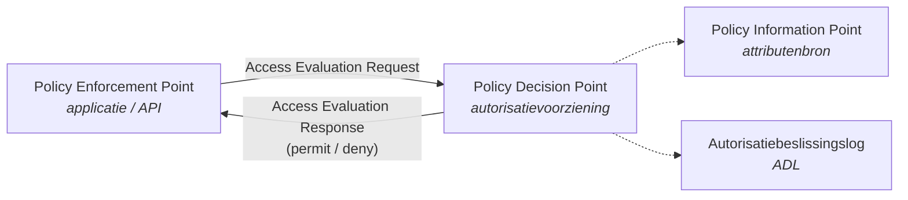

<h1 align="center">NLgov Profile for OpenID AuthZEN Authorization API</h1>

  <em>Nederlands overheidsprofiel op de OpenID AuthZEN Authorization API. 
  Toegangsvragen en -beslissingen uitwisselen tussen applicaties en autorisatievoorzieningen.</em>

  
  
  
  

  <a href="https://gitdocumentatie.logius.nl/publicatie/ftv/authzen/"><b>Vastgestelde versie</b></a> &nbsp;·&nbsp;
  <a href="https://logius-standaarden.github.io/authzen-nlgov/"><b>Werkversie</b></a> &nbsp;·&nbsp;
  <a href="https://github.com/Logius-standaarden/authzen-nlgov/issues/new/choose"><b>Issue indienen</b></a> &nbsp;·&nbsp;
  <a href="https://vng-realisatie.github.io/ftv/methodiek/authzen-nlgov/"><b>Project FTV</b></a> &nbsp;·&nbsp;
  <a href="https://gitdocumentatie.logius.nl/publicatie/api/beheermodel/"><b>Beheermodel</b></a>

---

## Beheerstatus

<!-- BEHEER:START -->
<!-- Dit blok kan waarschijnlijk automatisch gegenereerd worden via .github/workflows/readme.yml.
     Handmatige wijzigingen tussen BEHEER:START en BEHEER:END worden dan overschreven. -->

| | Branch | Status | Versie | Publicatiedatum |
|---|---|---|---|---|
| **Vastgesteld** | `main` | Definitief (DEF) | 1.0.0 | 25 juni 2026 |
| **Werkversie** | `develop` | Werkversie (WV) | 1.0.0 | 25 juni 2026 |

> `develop` loopt **0 commits** voor op `main` — geen onverwerkte wijzigingen richting release.

### Openstaande issues — 1 open, 0 gesloten

| Status | Aantal | Issues |
|---|---|---|
| `Status: In onderzoek` | 1 | [#7](https://github.com/Logius-standaarden/authzen-nlgov/issues/7) |
| `Status: In bewerking` | 0 | — |
| `Status: Uitwerking door derden` | 0 | — |
| `Status: Ter goedkeuring` | 0 | — |
| `Status: Gereed` | 0 | — |
| `Status: Klaar voor release` | 0 | — |
| _zonder Status-label_ | 0 | — |

- **Op de agenda van een overleg:** geen issues met een `Overleg:`-label.
- **Niet behandeld** (geen `Type:`-label): geen.

### Openstaande pull requests — 0 open

_Geen openstaande pull requests._

### Laatste geslaagde publicatie

`Build and Check` #53 op `main` — publicatie naar `gitdocumentatie.logius.nl` geslaagd.

Laatst bijgewerkt: 14 augustus 2026, 09:00 CEST · <a href="https://github.com/Logius-standaarden/authzen-nlgov/actions/workflows/readme.yml">workflow</a> <!-- Hier moet een echte link komen naar een workflow, als we dit willen automatiseren -->
<!-- BEHEER:END -->

---

## Over deze standaard

AuthZEN is een standaard van de OpenID Foundation voor het uitwisselen van toegangsvragen en -beslissingen tussen een **Policy Enforcement Point (PEP)** en een **Policy Decision Point (PDP)**. Dit profiel legt vast hoe die uitwisseling er binnen de Nederlandse overheid uitziet: welke velden verplicht zijn, welk informatiemodel geldt, en welke eisen aan transport en beveiliging worden gesteld.

Het profiel is ontwikkeld door VNG Realisatie vanuit een vernieuwingsvoorstel van de GDI, in het kader van het **Federatief Datastelsel (FDS)**. Beheer ligt bij Logius.

 <!-- geen idee of we dit willen bijhouden maar ziet er wel nice uit -->

<b>Verwante standaarden en profielen</b>

 

| Standaard | Rol ten opzichte van dit profiel | Repository |
|---|---|---|
| Autorisatiebeslissingslog (ADL) | Vastleggen van genomen toegangsbeslissingen | [`authorization-decision-log`](https://github.com/Logius-standaarden/authorization-decision-log) |
| NLgov Assurance profile for OAuth 2.0 | Levert het access token waarmee de PEP zich identificeert | [`OAuth-NL-profiel`](https://github.com/Logius-standaarden/OAuth-NL-profiel) |
| NLgov Assurance profile for OpenID Connect | Levert de authenticatie van de eindgebruiker | [`OIDC-NLGOV`](https://github.com/Logius-standaarden/OIDC-NLGOV) |
| NLgov Profile for CloudEvents | Notificatiepatroon bij wijzigende autorisaties | [`NL-GOV-profile-for-CloudEvents`](https://github.com/Logius-standaarden/NL-GOV-profile-for-CloudEvents) |

---

## Licentie

De specificatie staat onder [Creative Commons Naamsvermelding 4.0 Internationaal](LICENSE) (CC-BY-4.0). Dit document is een bewerking van de [OpenID AuthZEN Authorization API 1.0 draft 04](https://openid.net/specs/authorization-api-1_0-04.html) van de OpenID Foundation; voor zover die specificatie hierin is opgenomen geldt de [OpenID Copyright License](https://openid.net/intellectual-property/contribution-license-agreement/). Opname impliceert geen goedkeuring door de OpenID Foundation. (geen idee of dit nodig is)

